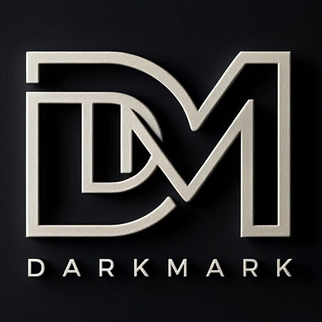

# DarkMark - Automatisches PDF-Schwärzungstool

 <!-- Pfad zum Logo anpassen, falls abweichend -->

DarkMark ist eine intuitive Desktop-Anwendung, die entwickelt wurde, um sensible Informationen in PDF-Dokumenten automatisch zu schwärzen. Basierend auf Bild-Templates identifiziert und maskiert DarkMark wiederkehrende Muster wie Unterschriften, Logos oder Stempel über mehrere Dokumente hinweg.

## ✨ Funktionen

*   **Automatisierte Schwärzung:** Erkennt und schwärzt vordefinierte Bild-Templates in PDF-Dokumenten.
*   **Stapelverarbeitung:** Verarbeiten Sie ganze Ordner voller PDFs in einem Durchgang.
*   **Interaktive Vorschau:** Zeigen Sie die potenziellen Schwärzungen vor dem endgültigen Speichern an.
*   **Benutzerdefinierte Template-Erstellung:** Importieren Sie eine PDF-Seite und markieren Sie Bereiche direkt in der Anwendung, um eigene Schwärzungs-Templates zu erstellen.
*   **Template-Verwaltung:** Importieren, sichern, neu laden oder löschen Sie Ihre benutzerdefinierten Templates.
*   **Benutzerfreundliche Oberfläche:** Eine moderne und intuitive GUI auf Basis von PySide6.
*   **Drag & Drop:** Einfaches Laden von PDFs oder Ordnern per Drag & Drop.
*   **Plattformunabhängig:** Läuft auf Windows, macOS und Linux (getestet mit PySide6).

## 🚀 Installation

Um DarkMark lokal auszuführen, befolgen Sie diese Schritte:

1.  **Voraussetzungen:** Stellen Sie sicher, dass Python 3.8+ auf Ihrem System installiert ist.

2.  **Repository klonen:**
    ```bash
    git clone https://github.com/JohannesGschwendtner/DarkMark.git
    cd DarkMark
    ```

3.  **Virtuelle Umgebung erstellen (empfohlen):**
    ```bash
    python -m venv venv
    # Auf Windows:
    .\venv\Scripts\activate
    # Auf macOS/Linux:
    source venv/bin/activate
    ```

4.  **Abhängigkeiten installieren:**
    ```bash
    pip install -r requirements.txt
    ```

5.  **Anwendung starten:**
    ```bash
    python main.py
    ```

## 🖥️ Verwendung

### 1. Schwärzungsmodus (Standardansicht)

Nach dem Start befinden Sie sich im Schwärzungsmodus.

*   **PDFs laden:**
    *   Klicken Sie auf "Einzelne PDF", um eine einzelne Datei auszuwählen.
    *   Klicken Sie auf "Ganzer Ordner", um alle PDFs in einem ausgewählten Ordner zu laden.
    *   Alternativ können Sie PDF-Dateien oder ganze Ordner direkt in das Anwendungsfenster ziehen (Drag & Drop).

*   **Navigation:**
    *   Nutzen Sie die Pfeil-Buttons, um zwischen geladenen PDFs und Seiten zu wechseln.

*   **Aktionen ausführen:**
    *   **"Alle PDFs schwärzen (Vorschau)"**: Verarbeitet alle geladenen PDFs und speichert temporäre, geschwärzte Vorschau-Dateien. Diese werden dann in der Anwendung angezeigt.
    *   **"Vorschau speichern"**: Speichert die aktuell angezeigte geschwärzte Vorschau-PDF permanent auf Ihrer Festplatte.
    *   **"Zurück zu Original-PDFs"**: Verlässt den Vorschau-Modus und löscht die temporären Vorschau-Dateien.
    *   **"Alle PDFs verarbeiten & speichern"**: Die endgültige Stapelverarbeitung. Wählen Sie einen Ausgabeordner, und DarkMark speichert alle geschwärzten PDFs dort permanent.

### 2. Template-Erstellungsmodus

Dieser Modus ermöglicht es Ihnen, eigene Schwärzungs-Templates zu erstellen, indem Sie Bereiche auf einer PDF-Seite markieren.

*   **Zugriff:** Klicken Sie auf den Button "Templates verwalten (Passwort)" unten links.
    *   **Passwort:** Das Standardpasswort ist `sessel`.
    *   Nach erfolgreicher Eingabe wechselt die Anwendung in den Template-Erstellungsmodus.

*   **Templates erstellen:**
    1.  Klicken Sie auf "PDF importieren", um eine PDF-Datei zu laden, aus der Sie Templates erstellen möchten.
    2.  Ziehen Sie mit der Maus Rechtecke über die Bereiche, die als Templates gespeichert werden sollen (z.B. Unterschriften, Firmenlogos, Stempel).
    3.  "Letzte Markierung entfernen" löscht das zuletzt gezeichnete Rechteck.
    4.  "Markierte Bereiche als Templates speichern" speichert jeden markierten Bereich als separate PNG-Datei.

*   **Template-Verwaltung:**
    *   **"Templates neu laden"**: Aktualisiert die Liste der Templates aus dem Speicherordner. Nützlich, wenn Sie manuell Templates hinzugefügt haben.
    *   **"Templates importieren (Ordner wählen)"**: Kopiert `.png`, `.jpg` und ähnliche Bilddateien aus einem ausgewählten Ordner in Ihr Benutzer-Template-Verzeichnis.
    *   **"Templates sichern (Ordner wählen)"**: Kopiert alle Ihre benutzerdefinierten Templates in einen Sicherungsordner Ihrer Wahl.
    *   **"Alle Templates löschen"**: Löscht unwiderruflich *alle* benutzerdefinierten Templates aus dem Speicherordner. **Vorsicht!**

*   **Zurück zum Schwärzungsmodus:** Klicken Sie auf "Zurück zum Schwärzen", um zum Hauptbildschirm zurückzukehren.

### ⌨️ Tastatur-Shortcuts

*   **`b`**: Navigiert zum **B**isherigen PDF (im Schwärzungsmodus).
*   **`n`**: Navigiert zum **N**ächsten PDF (im Schwärzungsmodus).
*   **`Strg + Pfeil Links`**: Navigiert zur **vorherigen Seite** des aktuellen PDFs (im Schwärzungsmodus).
*   **`Strg + Pfeil Rechts`**: Navigiert zur **nächsten Seite** des aktuellen PDFs (im Schwärzungsmodus).
*   **Geheimnisvoller Trigger**: Tippen Sie das Wort `dark` (oder `d-a-r-k`) an einer beliebigen Stelle in der Anwendung, um die Vorschau-Schwärzung zu starten (im Schwärzungsmodus, wenn PDFs geladen sind).

## 📂 Template-Speicherpfade

DarkMark speichert Ihre benutzerdefinierten Templates in einem plattformspezifischen Benutzerdatenverzeichnis, um die Portabilität und den Schutz der Templates zu gewährleisten.

Die Templates werden als 300 DPI PNG-Bilder gespeichert. Das ist die optimale Auflösung für die Schwärzungserkennung.

Der genaue Pfad ist:

*   **Windows:** `C:\Users\<Benutzername>\AppData\Local\JohannesGschwendtner\DarkMark\darkmark_user_templates`
*   **macOS:** `/Users/<Benutzername>/Library/Application Support/DarkMark/darkmark_user_templates`
*   **Linux:** `/home/<Benutzername>/.local/share/DarkMark/darkmark_user_templates`

## 🤝 Mitwirken

Vorschläge, Fehlerberichte und Pull Requests sind herzlich willkommen!

## 📜 Lizenz

Dieses Projekt ist unter der MIT-Lizenz lizenziert - siehe die [LICENSE](LICENSE) Datei für Details.

## ✍️ Autor

*   **Johannes Gschwendtner**

---